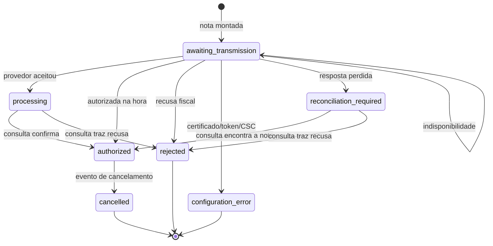

# Estados da emissão fiscal e cadastro incompleto

Este documento explica **por que** a emissão da NFC-e mudou em 31/08/2026 e como
ela se comporta agora. Ele complementa
[`FLUXO_PAGAMENTO_EMISSAO_FISCAL.md`](FLUXO_PAGAMENTO_EMISSAO_FISCAL.md), que
descreve o percurso completo do pagamento até a impressão.

> **Aviso fiscal:** CRT, CFOP, NCM, CEST, CSOSN/CST, PIS, COFINS, série e
> numeração devem ser definidos ou validados pela contabilidade. O StarChef
> transporta e calcula os campos configurados; ele não determina o
> enquadramento tributário correto do estabelecimento ou do produto.

## O que estava errado

Quatro problemas, todos com a mesma forma: o sistema respondia com mais
confiança do que tinha.

1. **Qualquer HTTP 200 virava `AUTHORIZED` no PDV.** `pushFiscal` não olhava o
   corpo da resposta. Uma nota que o backend devolvia com `emitted: false`, uma
   que ficara aguardando autorização e uma efetivamente autorizada eram gravadas
   na fila local do mesmo jeito. O caixa via "nota autorizada" nos três casos.

2. **Qualquer exceção do provedor virava contingência.** O `except Exception` de
   `emit_fiscal_invoice` capturava desde uma queda de rede até uma rejeição
   tributária definitiva e um certificado vencido. Os três viravam `tpEmis = 9`
   com `status = pending`, e o reprocessamento periódico passava a retransmitir
   indefinidamente uma nota que a SEFAZ já recusara em definitivo.

3. **A contingência nunca foi contingência.** `_build_payload` não envia
   `forma_emissao`, `numero` nem `serie`. O StarChef montava localmente uma
   chave com `tpEmis = 9`, imprimia o DANFE e entregava ao cliente — mas nada era
   transmitido à Focus como documento offline. Na retransmissão o payload ia
   como emissão **normal**, a Focus autorizava com numeração própria e
   `apply_response` sobrescrevia `access_key`, `number` e `series`. **A chave
   impressa no cupom do cliente nunca correspondia ao documento autorizado.**

4. **Cadastro incompleto era preenchido em silêncio.** `_build_item` completava
   o que faltasse com `00000000` (NCM), `5102` (CFOP), `102` (situação do ICMS) e
   `49` (PIS/COFINS), na transmissão, depois de o cliente já ter pago e longe de
   quem poderia corrigir.

Como consequência de (3) e (4), `FiscalConfig.series` e `next_number` do
PostgreSQL são hoje uma sequência **independente** da numeração real da Focus —
decorativos para esse provedor.

## Estados fiscais

`Invoice.status` sozinho não basta. `pending` cobria desde "ainda não saiu
daqui" até "pode ter sido emitida e não sabemos". Quem está offline precisa
dessa diferença para decidir entre reenviar, consultar ou parar.

A situação detalhada vem de `fiscal_state_of()`, derivada de `status` mais
`fiscal_payload["awaiting"]` / `fiscal_payload["failure"]`. Ela é exposta na
resposta de `POST /invoices/emit/` como `fiscal_state`, e o PDV a grava na
própria fila.



| Estado | Significado | Próxima ação |
|---|---|---|
| `awaiting_transmission` | Nunca chegou ao provedor | Transmitir de novo |
| `processing` | Provedor recebeu; SEFAZ processa | **Consultar**, nunca reenviar |
| `reconciliation_required` | Pode ter sido emitida; a resposta se perdeu | **Consultar**, nunca reenviar |
| `authorized` | Autorizada pela SEFAZ | Imprimir o DANFE |
| `rejected` | Recusa definitiva | Correção humana; sem retentativa |
| `configuration_error` | Certificado, token, CSC ou cadastro inválido | Corrigir a configuração |
| `cancelled` | Cancelada | — |

A distinção que sustenta tudo isso são as exceções tipadas em `providers.py`:

| Exceção | Quando | Efeito |
|---|---|---|
| `FiscalUnavailable` | Timeout, conexão recusada, HTTP 429/5xx | Única que autoriza retentativa automática |
| `FiscalRejection` | Recusa da SEFAZ, documento inválido, HTTP 4xx | Para de tentar |
| `FiscalConfigurationError` | HTTP 401/403, token/URL/modelo ausente | Para de tentar; não é problema deste pedido |
| `FiscalAmbiguous` | `already_processed` sem consulta bem-sucedida; chave inválida numa resposta autorizada | Consultar antes de qualquer reenvio |
| `FiscalNotFound` | HTTP 404 numa **consulta** | O documento não está no provedor: libera a retransmissão |

`FiscalNotFound` existe separado de propósito. Pelo classificador geral, um 404
seria `FiscalRejection` — e marcaria como recusada justamente a nota que nunca
conseguiu ser transmitida. Numa consulta, 404 quer dizer "o documento não está
aqui", e é a única resposta que resolve uma nota presa em
`reconciliation_required` com segurança: se o provedor não tem o documento,
retransmitir não duplica nada.

Reenviar às cegas depois de uma resposta perdida é o caminho para **duplicar
documento fiscal**. Por isso `reprocess_pending_fiscal_invoices` e
`resend_fiscal_invoice` chamam `provider.status()` — e não `provider.emit()` —
quando o estado é `processing` ou `reconciliation_required`.

### Reenvio depois de timeout é seguro

Um timeout no POST é classificado como `FiscalUnavailable`, e não como
ambiguidade, porque a Focus trata `ref` como chave de idempotência: um POST
repetido devolve `422 already_processed`, e o resultado real vem da consulta
feita em seguida. Só quando **essa consulta** também falha o estado vira
`reconciliation_required`.

## Contingência foi removida do fluxo cloud

`tpEmis = 9` deixou de ser gravado em notas novas. Não é regressão: o que existia
não era contingência, era uma chave decorativa (problema 3 acima).

Contingência de verdade exige enviar `forma_emissao=offline` com número, série e
código único alocados por quem emite — e, quando a própria Focus está
inalcançável, isso só é possível com o **agente fiscal local** falando com o
Comunicador Offline. Enquanto ele não existir, o comportamento correto é a nota
ficar `awaiting_transmission` e **nenhum cupom fiscal ser impresso**.

Notas antigas já gravadas com `tpEmis = 9` continuam sendo reprocessadas e
seguem imprimíveis: o cupom delas já foi (ou seria) entregue com esse aviso.

## DANFE só de nota autorizada

`is_fiscally_printable()` libera a impressão apenas para documento autorizado —
ou para a contingência legada. Uma nota pendente tem chave montada localmente,
que a consulta no portal da SEFAZ não encontra.

- `POST /invoices/{id}/print/` devolve **400** com o motivo;
- a impressão automática do pagamento emite só o recibo da venda;
- o PDV usa o campo `printable` da resposta para nem oferecer o DANFE.

### E o cupom sai quando a autorização chega

Bloquear a impressão sem mais nada deixaria a venda offline **sem cupom fiscal
nenhum**: o DANFE não sai no pagamento e, antes, nada criava o trabalho quando a
autorização chegava depois — a nota ficava autorizada no banco e alguém teria que
abrir o pedido e clicar em imprimir, sem nenhum aviso de que precisava.

`ensure_fiscal_print_job()` fecha esse ciclo. Todo caminho que autoriza uma nota
tardiamente enfileira o DANFE na impressora do pedido:

| Caminho | Quando acontece |
|---|---|
| Webhook da Focus | Autorização assíncrona; é o caso mais comum |
| `reprocess_pending_invoices` | A conexão voltou e o lote retransmitiu |
| `POST /invoices/{id}/resend/` | Reenvio manual de uma nota que não saiu |
| `POST /invoices/{id}/refresh-status/` | Consulta manual encontrou a autorização |

### A consulta não finge que consultou

`refresh-status` chamava `get_provider(invoice.provider)`. O campo `provider` só
é gravado quando a emissão chega ao provedor, então numa nota que nunca saiu
daqui ele está vazio — e `get_provider("")` devolve o provedor Manual, cujo
`status()` apenas repete o que já estava no banco. A API respondia 200 sem ter
falado com ninguém.

`refresh_fiscal_invoice_status()` resolve o provedor pela configuração quando o
campo está vazio, e recusa com o motivo quando nenhum provedor configurado
transmite — em vez de devolver um 200 vazio de significado. O resultado é
persistido com o mesmo vocabulário dos outros caminhos (`awaiting` / `failure`),
auditado, e dispara a impressão se a nota tiver acabado de ser autorizada.

É idempotente por pedido (`_already_printed`), então chamar de vários caminhos
não gera cupom duplicado. E nunca levanta: impressora fora do ar não pode
desfazer uma autorização que já aconteceu, nem derrubar o lote de
reprocessamento — o trabalho fica na fila de impressão, que tem retentativa
própria.

## O retrato fiscal fica no terminal

Antes, a fila fiscal do PDV guardava `{order, cpf, client_document_id}` e toda a
tributação era resolvida no servidor. A fila era "offline" só no nome.

`FiscalSnapshotBuilder` (`flutter/lib/core/data/fiscal_snapshot.dart`) captura,
no gesto do pagamento, a partir do SQLite local:

- emitente, ambiente, modelo e série (`fiscal_config`);
- itens com NCM, CEST, CFOP, CSOSN/CST, origem e tributos calculados;
- pagamentos, consumidor e totais;
- o `updated_at` do perfil e da configuração usados — o carimbo da versão.

O snapshot é **imutável**: corrigir o NCM de um produto amanhã não muda a nota de
ontem. E ele não inventa tributação — o que falta vira `issues`, devolvido à tela
em `_fiscal_issues`.

## Cadastro incompleto: os quatro fallbacks

Os quatro defaults não têm o mesmo risco, então não receberam o mesmo
tratamento.

| Fallback | Risco | Tratamento |
|---|---|---|
| NCM `00000000` | **Alto** — pode ser aceito e gerar documento fiscalmente errado, o que é pior que uma recusa | Reportado; bloqueia sob `strict` |
| Situação do ICMS `102` | **Alto** — CSOSN só existe no Simples; em regime normal é recusa certa | Escolhido pelo CRT; ver abaixo |
| CFOP `5102` | Médio — correto na maioria da venda de balcão, errado em produção própria (5101) ou ST (5405) | Reportado; bloqueia sob `strict` |
| PIS/COFINS `49` | Baixo — "outras operações" é amplamente aceito | Continua como default legítimo |

### A correção do CRT não depende de flag

`_build_item` fazia `item.csosn or item.cst_icms or "102"` sem nunca olhar
`config.crt`. Numa empresa de regime normal isso enviava um CSOSN, que a SEFAZ
recusa de qualquer forma — o fallback não evitava problema nenhum, apenas
trocava "cadastro incompleto" por "rejeição".

Agora `_icms_situation()` escolhe pelo regime:

- CRT 1 ou 2 (Simples): usa `csosn`, com `102` como padrão do varejo;
- CRT 3 (regime normal): usa `cst_icms` e, **sem ele, falha com mensagem clara,
  mesmo com `strict_fiscal_profile` desligado**.

Não existe CST padrão seguro. Adivinhar um produziria uma nota aceita e errada, e
as instalações nessa situação não conseguem emitir hoje de qualquer maneira — a
mudança é estritamente melhor que o comportamento anterior.

### O flag `strict_fiscal_profile`

Campo booleano em `FiscalConfig`, **padrão `False`**. É o que permite corrigir o
problema sem quebrar quem está em produção hoje:

| `strict_fiscal_profile` | Comportamento |
|---|---|
| `False` (padrão) | A emissão segue com os defaults do provider, **mas** as pendências ficam gravadas em `Invoice.fiscal_payload["fiscal_profile_issues"]` e contadas na auditoria |
| `True` | A nota nem é transmitida: vira `rejected` com a lista do que falta |

O ponto do modo permissivo não é tolerar o erro, é **medi-lo**. Com as pendências
registradas dá para descobrir quais contas ainda dependem dos valores padrão,
migrar cada uma, e só então virar o default — expandir, migrar, contrair.

A validação vive em `apps/invoices/fiscal.py` (`fiscal_profile_issues`,
`fiscal_item_issues`, `fiscal_invoice_issues`) e devolve o mesmo formato
`{field, label, message}` que `company_payload_missing_fields` já usava para o
cadastro do emitente.

### O flag vale nas duas portas

`strict_fiscal_profile` é checado na emissão **e no reenvio**. Um flag verificado
em apenas uma das portas não é um flag, é uma sugestão.

E o reenvio faz mais uma coisa: **remonta os `InvoiceItem` com o cadastro de
agora**. Sem isso, o gesto óbvio do operador — "corrigi o perfil fiscal e
reenviei" — não teria efeito nenhum, porque o item guarda o retrato congelado na
emissão e voltaria a mandar o mesmo `00000000`.

A imutabilidade do retrato continua valendo onde ela importa: uma nota que
**existe** na SEFAZ nunca é remontada. O reenvio só alcança notas que nunca
foram transmitidas (`awaiting_transmission` ou `error`); uma nota em
`processing` ou `reconciliation_required` é consultada, não reenviada, e uma
autorizada é recusada.

### Conferência antes do turno

```text
GET /api/v1/fiscal/config/readiness/?restaurant=<id>
```

Responde a pergunta na hora certa — antes da primeira venda — em vez de deixar o
cadastro incompleto aparecer depois do pagamento, quando o cliente já foi embora.

```json
{
  "ready": false,
  "strict": false,
  "company_issues": [],
  "products_checked": 128,
  "products_with_issues": 3,
  "products": [
    {
      "product": "…",
      "name": "Refrigerante lata",
      "internal_code": "REF01",
      "fiscal_profile": null,
      "issues": [
        {
          "field": "fiscal_profile",
          "label": "Perfil fiscal",
          "message": "Refrigerante lata: sem perfil fiscal definido."
        }
      ]
    }
  ]
}
```

Cobre as duas metades: o cadastro do emitente (as mesmas pendências que a
sincronização com a Focus já checava) e os produtos ativos do restaurante. Um
produto sem perfil próprio não é pendência se a configuração tiver
`default_profile` completo.

## Como migrar uma conta para o modo estrito

1. Chamar `readiness` para o restaurante e corrigir o que aparecer.
2. Emitir em homologação e conferir que
   `fiscal_payload["fiscal_profile_issues"]` não aparece nas notas novas.
3. Ligar `strict_fiscal_profile` na `FiscalConfig` daquela filial. A partir daí,
   corrigir o perfil e chamar `POST /invoices/{id}/resend/` remonta os itens com
   o cadastro corrigido e transmite.
4. Acompanhar `fiscal_state = rejected` nos primeiros dias — sob `strict`, um
   produto novo cadastrado sem perfil passa a bloquear a venda **da nota**, não
   a venda em si: o pedido continua sendo pago e o recibo continua saindo.

## O que ainda falta

Isto cobre os passos 1 a 3 do plano de autoridade fiscal local, mais o
tratamento de cadastro incompleto. Continuam pendentes:

- máquina de estados persistida com tabelas de sequência e eventos;
- o **StarChef Fiscal Agent** e o adaptador do Comunicador Offline da Focus;
- centralização dos caixas secundários nesse agente via LAN;
- DANFE, XML e impressão no fluxo local;
- API idempotente de reconciliação no backend;
- evolução de `FiscalProfile` para grupo/regra/vigência, com IBS/CBS;
- liberação por feature flag, começando por homologação.

Enquanto o agente não existir, `FiscalConfig.next_number` e `series` seguem
divergindo da numeração real da Focus. Não reabilitar `tpEmis = 9` no fluxo cloud
antes disso: produziria de novo um cupom com chave que a SEFAZ não reconhece.
