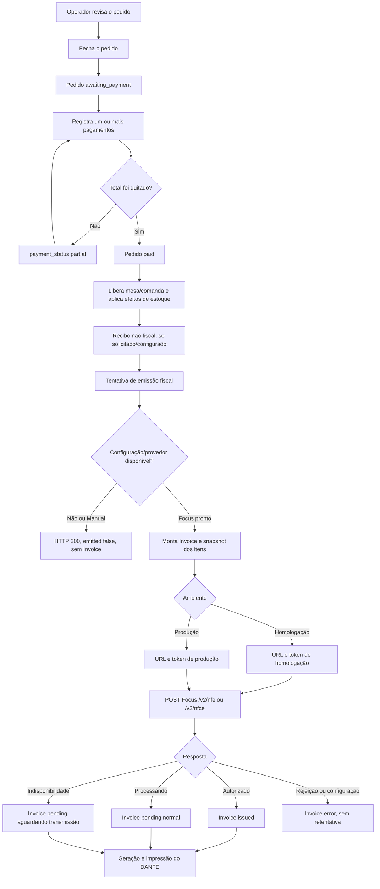

# Fluxo do pagamento à emissão da NF-e/NFC-e

Este documento descreve o comportamento **atual** do StarChef, do fechamento e
pagamento de um pedido até a geração, autorização e impressão do documento
fiscal. O fluxo foi conferido no backend Django, na retaguarda Vue e no PDV
Flutter em 30/08/2026 e revisado em 31/08/2026.

> **Revisão de 31/08/2026:** os estados fiscais, o fim da contingência
> `tpEmis = 9` no fluxo cloud, a impressão restrita a nota autorizada e o
> tratamento de cadastro incompleto estão explicados em
> [`EMISSAO_FISCAL_ESTADOS.md`](EMISSAO_FISCAL_ESTADOS.md). As seções abaixo já
> refletem essa revisão.

> **Aviso fiscal:** CRT, CFOP, NCM, CEST, CSOSN/CST, PIS, COFINS, série e
> numeração devem ser definidos ou validados pela contabilidade. O StarChef
> transporta e calcula os campos configurados; ele não determina o
> enquadramento tributário correto do estabelecimento ou do produto.

Para configurar credenciais, certificado, CSC e empresa Focus, consulte
[`FOCUS_NFE_CONFIGURACAO.md`](FOCUS_NFE_CONFIGURACAO.md). Para a arquitetura da
integração, consulte
[`INTEGRACAO_FISCAL_BRASIL.md`](INTEGRACAO_FISCAL_BRASIL.md).

## Resumo executivo

Pagamento e emissão fiscal são operações separadas:

- pagar integralmente muda o pedido para `paid`, libera mesa/comanda, registra
  o recebimento e pode baixar estoque;
- depois disso, uma tentativa de emissão chama
  `POST /api/v1/invoices/emit/`;
- falha fiscal ou de impressão **não desfaz o pagamento**;
- o provedor `manual` não transmite, não cria `Invoice` e responde
  `emitted: false`;
- o provedor `focus_nfe`, quando possui URL e token do ambiente, cria o
  documento local e transmite para a Focus;
- em homologação, o documento é de teste e o DANFE mostra
  **SEM VALOR FISCAL — HOMOLOGAÇÃO**;
- cada item usa primeiro o perfil fiscal do produto e depois o perfil padrão
  da configuração fiscal;
- sem qualquer perfil, o que falta é **registrado** na nota e devolvido ao
  terminal; com `strict_fiscal_profile` ligado, a nota nem é transmitida;
- cadastro fiscal incompleto **cria a nota mesmo assim**, com o motivo gravado
  nela (`fiscal_state = configuration_error`), para o operador ver o erro e
  reenviar depois de corrigir. Só restaurante que não emite NFC-e (provedor
  manual, ou sem configuração fiscal) segue sem gerar nota nenhuma;
- o DANFE só é impresso para nota **autorizada**: uma nota pendente tem chave
  montada localmente, que a SEFAZ não reconhece.

## Visão geral do fluxo



## 1. Preparação anterior à venda

### 1.1 Módulo e configuração fiscal

O endpoint de notas exige o módulo `financeiro` habilitado na conta. Cada
restaurante possui uma `FiscalConfig` ligada à sua filial.

Ao criar um restaurante, o serializer aceita `fiscal_provider` e usa `manual`
como padrão. O backend cria ou recupera a configuração fiscal por meio de
`ensure_fiscal_config`. Portanto:

- a ausência de escolha explícita no cadastro novo resulta normalmente em
  provedor `manual`;
- o clique de pagamento **não escolhe** o provedor naquele momento;
- em registros antigos, excluídos ou inconsistentes, pode não existir uma
  configuração fiscal ativa. Nesse caso a tentativa de emissão também é
  recusada sem criar nota.

### 1.2 Focus NFe

Para o provedor `focus_nfe`, existem dois níveis de credenciais:

1. a conta StarChef guarda token mestre, URLs de produção/homologação e webhook;
2. a configuração do restaurante guarda os tokens individuais da empresa para
   produção e homologação.

O token mestre sincroniza a empresa, mas não é usado diretamente na emissão.
O restaurante precisa ser sincronizado para receber o token individual do
ambiente selecionado.

### 1.3 Produtos e perfis fiscais

O perfil fiscal é compartilhado pela conta e pode ser associado a vários
produtos. Ele contém NCM, CEST, CFOP, origem, CSOSN/CST, alíquotas de ICMS,
PIS/COFINS e tributos aproximados.

Há dois conceitos diferentes:

- `FiscalProfile.is_default`: apenas destaca/sugere o perfil no cadastro;
- `FiscalConfig.default_profile`: é o perfil realmente usado como fallback na
  emissão quando o produto não possui um perfil próprio.

Marcar somente `is_default` não configura o fallback fiscal da filial.

## 2. Fechamento do pedido

No PDV, o operador revisa o pedido antes de entrar no pagamento. Se ainda
existirem itens pendentes, eles são enviados à cozinha primeiro. Em seguida o
cliente chama:

```text
POST /api/v1/orders/{order_id}/close/
```

O backend executa `close_order` dentro de uma transação:

1. bloqueia a linha do pedido para evitar fechamentos concorrentes;
2. recusa pedidos já pagos, cancelados ou estornados;
3. aplica desconto, exigindo gerente quando o desconto é maior que zero;
4. aplica ou remove a taxa de serviço;
5. recalcula subtotal e total;
6. quando recebido, compara `expected_total` com o total do servidor;
7. muda o pedido para `awaiting_payment`;
8. recalcula `payment_status` considerando pagamentos já aprovados.

Se o pedido já estiver integralmente pago após o recálculo, ele passa direto
para `paid`, libera mesa/comanda e executa a baixa de estoque quando o
restaurante usa baixa no pagamento.

## 3. Registro do pagamento

Cada pagamento é enviado para:

```text
POST /api/v1/orders/{order_id}/pay/
```

O corpo informa forma de pagamento, valor e, no PDV Flutter, uma chave de
idempotência. O backend `register_payment`:

1. devolve o pagamento existente quando a mesma chave idempotente já foi usada;
2. bloqueia o pedido durante o cálculo;
3. recusa pedido cancelado, estornado ou já pago;
4. exige uma forma ativa pertencente ao mesmo restaurante;
5. valida a sessão de caixa quando ela é obrigatória;
6. aceita pagamento parcial e combinação de formas;
7. permite valor recebido acima do saldo somente em dinheiro;
8. grava separadamente o valor aplicado e o troco;
9. cria movimento de venda no caixa para pagamento em dinheiro;
10. muda o pedido para `partial` ou `paid`.

Quando o total é quitado:

- `Order.payment_status = paid`;
- `Order.status = paid`;
- mesa e comanda são liberadas quando aplicável;
- a baixa de estoque ocorre se `stock_deduction_timing = payment`;
- o pagamento fica preservado mesmo se a etapa fiscal falhar depois.

O recibo comum do pedido é um comprovante operacional e contém a indicação de
que não é documento fiscal. Ele não substitui DANFE, NF-e ou NFC-e.

### 3.1 No PDV desktop, o recebimento é montado antes de ser enviado

A tela de pagamento **não envia nada** enquanto o operador escolhe formas e
valores. Cada "Adicionar pagamento" monta uma linha na tela
(`OrderPresenter.stagedPayment`), e o `POST /pay/` de todas elas acontece de
uma vez no clique de **Concluir pedido** (`_commitStagedPayments`).

Isso resolve três coisas que vinham juntas:

1. o pedido virava **pago** no instante em que o operador escolhia a forma de
   pagamento — antes de conferir troco, referência, ou de decidir dividir a
   conta;
2. excluir esse recebimento devolvia **HTTP 409** ("este recebimento já está
   subindo para o servidor"), porque a operação já estava na fila. O caixa
   ficava com um recebimento que não conseguia tirar. Uma linha ainda não
   enviada agora some da tela e pronto — ela não existe em lugar nenhum;
3. recibo e DANFE dependiam de o operador lembrar de voltar à tela para
   concluir. Agora a venda passa a paga e o papel sai no mesmo gesto.

Sair da tela com recebimentos montados pede confirmação: eles são descartados
e o pedido continua em aberto.

Antes de emitir a nota, o gesto **drena a fila de vendas**
(`ApiClient.flushSalesQueue`). A emissão fiscal parte do servidor, e uma nota
que chegasse lá antes dos recebimentos sairia com o DANFE sem as formas de
pagamento — justamente o que o cliente confere. Sem conexão isso não faz nada:
a venda segue pela fila e quem imprime é o próprio terminal.

## 4. Quem dispara a emissão

### 4.1 Retaguarda web

O `PdvView.vue` registra o pagamento e mostra “Pedido pago”, mas não chama a
emissão automaticamente. Na visualização de um pedido pago, a tela
`ResourceFormView.vue` exibe **Emitir nota fiscal / DANFE**.

Ao clicar nesse botão, a retaguarda:

1. chama `POST /invoices/emit/`;
2. se receber `emitted: false`, mostra o motivo e encerra o fluxo;
3. se receber uma nota, chama `POST /invoices/{invoice_id}/print/`;
4. abre o HTML do DANFE em outra janela e chama a impressão do navegador.

### 4.2 PDV Flutter

A impressão é do gesto de **Concluir pedido**, não do pagamento — e, desde a
mudança da §3.1, o pagamento também é desse gesto. Quando o operador clica,
`_completePaidOrder` envia os recebimentos montados, imprime o recibo da venda
e chama `_emitFiscalInvoice`, que imprime o DANFE — dois trabalhos, dois
documentos, na impressora master do terminal. Um pedido pago reaberto também
exibe **Emitir NFC-e / Imprimir DANFE**.

O recibo sai **com ou sem internet**. `/orders/{id}/print/` exige servidor,
então `_printSaleReceipt` monta o cupom no próprio terminal
(`_printReceiptLocally`) quando a venda ainda está na fila local, quando o
terminal é um Caixa Secundário, ou quando a chamada ao servidor é recusada no
meio do gesto. É o mesmo caminho que a reimpressão manual já usava. O DANFE
não tem equivalente offline: sem nota autorizada não existe documento fiscal
para imprimir — ele sai quando a autorização chegar.

**Quem pediu imprime.** Um terminal identificado tem para onde mandar o papel,
e é ele quem decide a hora — então o backend não cria `PrintJob` sozinho:

| Origem do pagamento | Quem imprime |
|---|---|
| PDV desktop | O próprio terminal, no clique de **Concluir pedido**, na impressora **master** — recibo e DANFE, dois trabalhos |
| Web | O navegador de quem fechou a venda (`showReceipt`), pelo diálogo de impressão do sistema |
| Sem terminal identificado (integração, cliente antigo) | O backend, automaticamente — não há para onde devolver o documento |

`register_payment` avisa o sinal `order_fully_paid` com `auto_print=False`
sempre que há terminal identificado, e `issue_invoice_for_paid_order` emite a
nota mas pula `print_sale_documents`.

Sem esse recorte, o papel saía **na impressora do balcão** por causa de uma
venda que podia ter sido fechada por alguém na retaguarda. E no desktop
duplicava: o trabalho automático nascia no instante do último pagamento
(sempre antes do clique em Concluir) e, quando o agente local já o tivesse
entregue, o clique não achava mais nada para reaproveitar
(`claim_pending_job`) e criava um cupom novo.

A emissão fiscal continua imediata em todos os casos — a SEFAZ pode demorar e
não há razão para prender isso ao clique.

No modo offline-first, a **emissão** (`POST /invoices/emit/`) é interceptada
antes da chamada HTTP e gravada na `fiscal_queue` local, inclusive com
internet disponível — é isso que impede uma queda no meio do caminho de perder
o documento de uma venda já paga. A fila fiscal:

- é separada da fila de vendas;
- envia uma nota por ciclo, a cada 30 segundos, ou em **Sincronizar agora**;
- repete falhas transitórias em 15 s, 30 s, 1 min, 5 min e 15 min;
- marca erros HTTP/validação como `FAILED` e não insiste automaticamente.

**Só a emissão passa pela fila.** `refresh-status`, `resend`, `cancel` e
`/invoices/{id}/print/` são operações do servidor: consultar a SEFAZ e
cancelar uma nota não existem sem rede. Interceptá-las criava um documento
fantasma na fila fiscal — sem pedido, porque o corpo dessas rotas não tem
`order` — que depois tentava emitir sozinho
(`OfflineFirstGateway.isFiscalEmission`).

### O pedido carrega os recebimentos

`payments` é uma relação reversa: `fields = "__all__"` não a incluía no
`OrderSerializer`. O PDV grava o recebimento local-first e, quando a fila
entrega, aplica por cima a versão do servidor — que vinha **sem pagamento
nenhum**. No instante seguinte à sincronização o pedido guardado no terminal
ficava sem recebimento, e é desse retrato que a emissão fiscal é montada
(`FiscalSnapshotBuilder`): o PDV recusava a própria venda com "A venda não tem
recebimento registrado" e a **NFC-e nunca era emitida**.

Só os recebimentos **aprovados** entram, na ordem em que foram feitos: um
recebimento cancelado não compõe o valor pago nem a nota. A listagem faz
`prefetch_related("payments__payment_method")` para não virar uma consulta por
pedido.

**E pendência no retrato local avisa, mas não veta.** Quem decide se a nota
passa é o servidor, que enxerga a venda inteira; no terminal só existe o que
ele guardou. O veto local matou uma NFC-e cujo recebimento existia — ele tinha
acabado de subir. O backend já trata cadastro incompleto do jeito certo: monta
a nota, grava a falha nela, e deixa o operador corrigir e reenviar.

### Com internet, o cupom fiscal sai no mesmo gesto

A chamada inicial devolve `_fiscal_pending: true`, mas o PDV não espera o
ciclo de 30 segundos: `flushFiscalForOrder` entrega a nota na hora, com até
cinco tentativas curtas (`_flushFiscalWithRetries`, ~10s no total) para
cobrir uma entrega que estava só um instante atrás da nossa — outro ciclo de
sincronização em voo, um `ping` que falhou uma vez. Três respostas são
possíveis:

1. **autorizada** (`printable: true`) — o DANFE vai para a impressora master
   junto com o recibo, no mesmo clique;
2. **em trânsito** (`processing` / `awaiting_transmission`) — o caso comum: a
   Focus aceita e a SEFAZ autoriza um instante depois;
3. **ainda não confirmada** mesmo após as tentativas — sem conexão no
   instante, ou a fila genuinamente não conseguiu entregar ainda. **A venda
   NUNCA termina em silêncio**: um aviso avisa o operador, e a nota segue na
   fila fiscal local até o ciclo automático de 30s (ou até o operador
   reabrir o pedido) conseguir. Antes, esse aviso ficava escondido atrás da
   mesma bandeira que evita nagging num restaurante sem NFC-e
   (`silentIfUnconfigured`) — a venda terminava só com o recibo, sem
   explicação nenhuma.

No caso 2, `_watchFiscalAuthorization` consulta
`POST /invoices/{id}/refresh-status/` em segundo plano, com espera crescente
(1,2 s, 2 s, 3 s, 4 s, 5 s — cerca de 15 s no total), e imprime o DANFE assim
que a autorização chega. Não bloqueia o caixa: a próxima venda já pode
começar. Uma recusa (`rejected`, `configuration_error`) interrompe a espera e
avisa o operador — isso não se resolve esperando.

Se a autorização não chegar nessa janela, nada se perde: a nota segue na
esteira normal (webhook da Focus e consulta periódica), e o backend enfileira
o DANFE por `ensure_fiscal_print_job` — a menos que a venda já esteja marcada
`terminal_prints` (§4.2), caso em que só o próprio terminal insiste. O cupom
também pode ser reimpresso pelo histórico do pedido.

Toda resposta de nota (`emit`, `refresh-status`, `resend`, `cancel`) carrega
`fiscal_state` e `printable`. Sem esses dois campos, uma nota que voltava
autorizada da consulta continuava sendo tratada pela tela como não-imprimível.

### `push()` da fila de vendas é reentrante

`SyncService.push()` drena a fila de vendas (`sync_queue`). Ele roda também
por um timer periódico (debounce de 450ms após qualquer escrita local), e o
gesto de concluir o pedido precisa da GARANTIA de que o recebimento chegou ao
servidor antes de emitir a nota (§3.1) — por isso chama `push()` de novo,
possivelmente enquanto o ciclo periódico ainda está em voo.

Uma chamada concorrente não desiste mais quando outra já está em andamento:
ela marca que precisa de mais uma volta e ESPERA o mesmo ciclo terminar
(`_pushCycle`/`_pushAgain`). Antes, a segunda chamada retornava
IMEDIATAMENTE — um no-op silencioso — e quem chamou seguia em frente achando
a fila drenada sem ela estar. Era mais uma via para a venda terminar só com o
recibo: a emissão fiscal partia com o pedido ainda sem o pagamento
confirmado no servidor.

Se o pagamento inteiro ainda estiver apenas no SQLite aguardando
sincronização, `_completePaidOrder` não chama a emissão automática. Primeiro a
venda precisa subir; depois a nota precisa ser solicitada pelo fluxo fiscal.

## 5. Pré-validação do endpoint de emissão

O cliente envia:

```http
POST /api/v1/invoices/emit/
Content-Type: application/json

{
  "order": "UUID_DO_PEDIDO",
  "cpf": "12345678909",
  "cpf_name": "Nome do consumidor"
}
```

`cpf` e `cpf_name` são opcionais. O endpoint valida o tenant e procura o pedido.
Depois chama `fiscal_emission_unavailable_reason`.

| Situação | HTTP | Resultado |
|---|---:|---|
| Pedido não existe na conta | 404 | Nenhuma nota criada |
| Sem configuração fiscal ativa | 200 | `emitted: false`; nenhuma nota criada |
| Provedor `manual` | 200 | `emitted: false`; nenhuma nota criada |
| Provedor desconhecido | 200 | `emitted: false`; nenhuma nota criada |
| Focus sem configuração da conta | 200 | `emitted: false`; nenhuma nota criada |
| Focus sem URL do ambiente | 200 | `emitted: false`; nenhuma nota criada |
| Focus sem token individual do ambiente | 200 | `emitted: false`; nenhuma nota criada |
| Focus com URL e token | 201 | Monta a nota e tenta transmitir |

Exemplo do retorno não emitido:

```json
{
  "emitted": false,
  "message": "Nota fiscal nao emitida: O provedor fiscal Manual esta selecionado e nao transmite notas fiscais."
}
```

O modo Manual não é uma nota local em rascunho neste endpoint. Embora exista
uma classe `ManualFiscalProvider.emit`, a pré-validação impede que ela seja
alcançada pela API normal.

## 6. Montagem da nota local

Quando o Focus está disponível, `emit_fiscal_invoice` bloqueia novamente o
pedido e monta a nota em uma transação:

1. resolve a configuração fiscal da filial ou do restaurante;
2. recusa uma segunda emissão se o pedido já possui nota `pending` ou `issued`;
3. exclui itens cancelados e itens de cortesia;
4. recusa o pedido quando não resta item faturável;
5. reserva `next_number`, série, modelo, ambiente e CRT;
6. cria chave de acesso e QR Code local;
7. grava emitente, consumidor e totais no `Invoice`;
8. cria um snapshot tributário de cada linha em `InvoiceItem`;
9. chama o provedor Focus;
10. incrementa `FiscalConfig.next_number`, inclusive quando a nota fica
    processando ou aguardando transmissão.

Entre os passos 8 e 9 entra a validação do perfil fiscal de cada item
(`fiscal_invoice_issues`). Com `strict_fiscal_profile` ligado ela interrompe
aqui, antes de qualquer chamada ao provedor.

O relacionamento `Order -> Invoice` é um para um. Alterar um produto ou perfil
depois da emissão não muda os `InvoiceItem` de uma nota que já existe na SEFAZ.

A exceção é o **reenvio de uma nota que nunca foi transmitida**: nesse caso não
há documento, e `resend_fiscal_invoice` remonta os itens com o cadastro atual —
é o que permite corrigir o perfil fiscal que faltava e reenviar. Notas em
`processing` ou `reconciliation_required` são consultadas, nunca remontadas.

### Estado do pedido exigido

As interfaces só oferecem o botão fiscal para pedidos com
`payment_status = paid`. Entretanto, o endpoint do backend não valida hoje se
o pedido está pago; uma chamada direta à API consegue emitir um pedido aberto.
Essa é uma proteção de interface, não uma regra de domínio no servidor.

## 7. Produto com perfil, perfil padrão e produto sem perfil

Para cada `OrderItem`, a escolha é:

```text
perfil = produto.fiscal_profile OU configuracao_fiscal.default_profile
```

| Cadastro do item | Snapshot em `InvoiceItem` | Payload enviado à Focus |
|---|---|---|
| Produto com perfil próprio | Copia todos os campos daquele perfil | Usa o snapshot do perfil |
| Produto sem perfil, com `default_profile` na filial | Copia o perfil padrão | Usa o snapshot do perfil padrão |
| Produto e filial sem perfil | Campos fiscais ficam vazios ou zerados | Registra pendência; aplica padrões se `strict` estiver desligado |

Os padrões aplicados quando nenhum perfil existe são:

| Campo | Padrão | Sob `strict_fiscal_profile` |
|---|---|---|
| NCM | `00000000` | Bloqueia |
| CEST | omitido | — |
| CFOP | `5102` | Bloqueia |
| Origem ICMS | `0` | — |
| Situação ICMS | `102` no Simples; **falha** em regime normal sem CST | Bloqueia |
| CST PIS | `49` | — |
| CST COFINS | `49` | — |
| Tributos aproximados | `0` | — |

`00000000` não é um NCM real, e o risco dele não é a recusa: é ser **aceito** e
gerar um documento fiscalmente errado. Por isso, mesmo com `strict` desligado, as
pendências ficam gravadas em `Invoice.fiscal_payload["fiscal_profile_issues"]` e
são devolvidas ao terminal — e podem ser conferidas antes do turno em
`GET /api/v1/fiscal/config/readiness/?restaurant=<id>`.

A situação do ICMS é escolhida pelo CRT da empresa: CSOSN no Simples, CST no
regime normal. Uma empresa em regime normal sem CST falha com mensagem clara
independentemente do flag — enviar CSOSN ali seria recusa certa de qualquer
forma. Ver [`EMISSAO_FISCAL_ESTADOS.md`](EMISSAO_FISCAL_ESTADOS.md).

O código atual também não ignora automaticamente um perfil marcado como
inativo se ele ainda estiver associado ao produto ou configurado como padrão.

## 8. Payload enviado à Focus

O modelo do documento define o recurso:

| Modelo configurado | Endpoint Focus |
|---|---|
| NF-e `55` | `POST /v2/nfe?ref=starchef-{invoice_uuid}` |
| NFC-e `65` | `POST /v2/nfce?ref=starchef-{invoice_uuid}` |
| SAT/CF-e `59` | Não suportado pelo provedor Focus |

A referência `starchef-{uuid}` identifica a nota no envio, consulta, webhook e
cancelamento.

O payload inclui:

- natureza “Venda ao consumidor”;
- data de emissão;
- emitente e consumidor final;
- presença `1` para venda presencial ou `4` para delivery;
- produtos, desconto, total e tributos aproximados;
- itens e respectivos campos fiscais;
- pagamentos aprovados e troco;
- CPF/nome quando informados.

Mapeamento das formas de pagamento:

| Forma StarChef | Código enviado |
|---|---:|
| Dinheiro | `01` |
| Cartão de crédito | `03` |
| Cartão de débito | `04` |
| Voucher | `10` |
| PIX | `17` |
| Outra | `99` |
| Nenhum pagamento encontrado | `90`, valor `0.00` |

Em dinheiro, `valor_pagamento` inclui o valor devolvido como troco, e o total do
troco também segue em `valor_troco`.

## 9. Homologação e produção

| Ambiente | URL/token usados | Validade fiscal | DANFE |
|---|---|---|---|
| Homologação (`2`) | URL e token de homologação | Sem validade fiscal | Mostra “SEM VALOR FISCAL — HOMOLOGAÇÃO” |
| Produção (`1`) | URL e token de produção | Documento fiscal real | Não mostra a faixa de homologação |

O ambiente não é escolhido pelo botão de pagamento. Ele vem da
`FiscalConfig`. Série, próximo número, CSC e token precisam corresponder ao
ambiente.

A interface Flutter usa o texto “NFC-e” mesmo quando o modelo configurado pode
ser NF-e `55`; quem decide entre `/v2/nfe` e `/v2/nfce` é o backend.

## 10. Respostas da Focus e estados da nota

| Resposta/situação | Estado local |
|---|---|
| `autorizado` | `status = issued`, emissão normal |
| `processando` ou `processando_autorizacao` | `status = pending`, `fiscal_state = processing` |
| `cancelado` | `status = cancelled` |
| Timeout, erro de rede, HTTP 429/5xx | `status = pending`, `fiscal_state = awaiting_transmission` |
| HTTP 401/403 ou credencial ausente | `status = error`, `fiscal_state = configuration_error` |
| Rejeição fiscal ou HTTP 4xx | `status = error`, `fiscal_state = rejected`, sem retentativa |
| `already_processed` sem consulta bem-sucedida | `status = pending`, `fiscal_state = reconciliation_required` |

Quando autorizada, a nota recebe chave, protocolo, número/série confirmados,
data de autorização, URLs de XML/DANFE e QR Code retornados pela Focus.

A venda é sempre preservada, mas o motivo da falha decide o que acontece com a
nota. `tpEmis = 9` **não é mais gravado** em notas novas: o que existia não era
contingência de verdade, porque o payload da Focus nunca levou
`forma_emissao`/`numero`/`serie` — o cupom saía com uma chave que a SEFAZ não
reconheceria. Notas antigas com `tpEmis = 9` continuam sendo reprocessadas.

Indisponibilidade mantém a nota `pending` e ela volta no reprocessamento;
rejeição e erro de configuração viram `error` e param de ser tentados. Ver
[`EMISSAO_FISCAL_ESTADOS.md`](EMISSAO_FISCAL_ESTADOS.md).

## 11. DANFE, impressão e acompanhamento

O DANFE é criado por:

```text
POST /api/v1/invoices/{invoice_id}/print/
```

O backend renderiza:

- HTML para navegador/spool do Windows;
- texto monoespaçado de 48 colunas para ESC/POS;
- QR Code e chave de acesso;
- indicação de homologação;
- indicação de contingência ou autorização pendente.

Depois cria um `PrintJob` do tipo `fiscal_danfe`. A impressão física é feita
pelo navegador ou pelo agente local do PDV, conforme o cliente.

O endpoint de impressão **exige documento autorizado** (`is_fiscally_printable`).
Uma nota `pending` tem chave montada localmente, que a consulta no portal da
SEFAZ não encontra: imprimi-la entregaria ao cliente um cupom que não
corresponde a documento fiscal nenhum. Nesse caso o endpoint devolve **400** com
o motivo, e a impressão automática do pagamento emite só o recibo da venda.
Contingência legada (`tpEmis = 9` já gravado) continua imprimível.

Para acompanhar documentos assíncronos:

- `POST /api/v1/invoices/{id}/refresh-status/` consulta a Focus;
- o webhook Focus atualiza a nota pela referência;
- `POST /api/v1/invoices/{id}/cancel/` solicita cancelamento;
- `python manage.py reprocess_pending_invoices` reprocessa notas `pending`:
  transmite as que aguardam transmissão e **consulta** as que estão processando
  ou em reconciliação — reenviar essas duplicaria o documento.

O reprocessamento não possui agendamento Celery/Beat no código atual. O comando
precisa ser executado manualmente ou agendado externamente.

## 12. Pontos de atenção da implementação atual

Esta seção registra o que o sistema faz hoje, mesmo quando ainda não é o fluxo
ideal desejado.

1. **Retaguarda não emite no clique de pagamento.** O botão de emissão fica na
   visualização posterior do pedido pago.
2. **Toda emissão do PDV passa pela fila fiscal**, inclusive com internet — é
   o que impede uma queda no meio do caminho de perder o documento de uma
   venda já paga. Com conexão, porém, o PDV não espera o ciclo de 30 s: entrega
   a nota na hora (`flushFiscalForOrder`) e, se ela voltar `processing`,
   consulta a autorização por cerca de 15 s antes de imprimir. Os dois
   documentos (recibo e DANFE) saem na impressora master, no clique de
   **Concluir pedido** — o backend não imprime por conta própria quando há
   terminal identificado.
3. **A fila Flutter lê a situação fiscal real.** `pushFiscal` interpreta
   `fiscal_state` e distingue autorizada, aguardando transmissão, processando,
   em reconciliação, recusada e erro de configuração. Um HTTP 200 com
   `emitted: false` não vira mais `AUTHORIZED`, e um 5xx volta para a escada de
   retentativa em vez de encerrar a nota.
4. **A autorização tardia enfileira o DANFE sozinha.** Webhook, reprocessamento,
   reenvio e `refresh-status` chamam `ensure_fiscal_print_job`, que cria o
   trabalho fiscal na impressora do pedido — idempotente por pedido, então não
   sai cupom duplicado.
5. **Nenhuma tela imprime nota não autorizada.** PDV e retaguarda só mandam o
   DANFE para o papel com `printable: true`; enquanto a SEFAZ processa, as
   duas consultam `refresh-status` em segundo plano e imprimem quando a
   autorização chega. Uma recusa interrompe a espera e avisa o operador.

   **Quem imprime fica gravado na nota.** `fiscal_payload.terminal_prints`
   marca que a venda saiu de um terminal identificado, e então NENHUM caminho
   de autorização cria cupom automático — nem o webhook da Focus, que costuma
   chegar antes de o PDV consultar. Sem isso saíam **dois DANFEs** da mesma
   venda: o que o agente local pegava da fila e o que o terminal mandava em
   seguida.

   A marca é gravada em dois pontos, porque a nota pode nascer por qualquer um
   deles: no pagamento (`issue_invoice_for_paid_order`, quando
   `auto_print=False`) e na emissão pedida pelo terminal (`POST /invoices/emit/`
   com `X-Terminal-Id`). A consulta também aceita `manual_print: true`, que
   cobre o caso de uma nota antiga sem a marca.

   Sem terminal identificado (integração, cliente antigo) o trabalho continua
   automático: ali não há ninguém na frente do cliente, e uma autorização que
   chega horas depois não sairia em impressora nenhuma.

   **Cupom sem impressora é um cupom que nunca sai.** O agente local procura
   `job.printer` na lista de equipamentos dele; com `printer_id` nulo ele não
   acha nada, pula, e volta a pular a cada ciclo — para sempre. Pior:
   `_already_printed` passa a enxergar um cupom fiscal para aquele pedido,
   então `ensure_fiscal_print_job` nunca mais cria um que preste, e o DANFE
   daquela venda não sai nem automático nem sozinho. Por isso
   `print_fiscal_invoice` resolve a impressora quando quem chamou não informou
   — como `register_print_job` (o recibo) já fazia. Quando nem o cadastro tem
   uma, o trabalho ainda é criado (ele é o registro do documento) mas nasce
   `manual_only`, fora do laço do agente.

   **E há uma última linha de defesa, no terminal.** O agente local guarda o
   que já entregou em `printed_documents`, com chave na NOTA
   (`danfe:<chave de acesso>`) e não no trabalho de impressão. Todo caminho
   automático — o laço do agente e a impressão que o gesto de concluir dispara
   — consulta essa marca antes de mandar papel. Assim, mesmo que dois
   trabalhos existam para a mesma nota, só um vira via. A reimpressão pedida
   pelo operador ignora a marca de propósito: quem clicou quer outra via, e
   isso é uma decisão, não uma duplicação.
6. **Produto sem perfil não é barrado por padrão.** Com
   `strict_fiscal_profile` desligado, o fallback NCM `00000000` ainda segue
   até a Focus (e tende a causar rejeição) — mas o que foi suprido fica
   registrado na nota e na auditoria. Com a flag ligada, a nota nem é
   transmitida.
7. **O backend não exige pedido pago.** A UI restringe o botão, mas a API aceita
   emissão direta de pedido aberto.
8. **Emitir é idempotente por pedido.** Uma nota `pending` ou `issued` já
   vinculada ao pedido faz o endpoint devolver a nota existente, não um HTTP
   400 — o PDV emite logo depois do pagamento automático e não pode ver
   "pedido já possui nota" numa venda que deu certo.

## 13. Matriz dos cenários principais

| Cenário | O pagamento conclui? | Cria `Invoice`? | Chama Focus? | Resultado esperado hoje |
|---|---:|---:|---:|---|
| Sem configuração fiscal ativa | Sim | Não | Não | `emitted: false` |
| Provedor Manual | Sim | Não | Não | `emitted: false` |
| Focus sem URL/token do ambiente | Sim | Não | Não | `emitted: false` |
| Focus homologação + produto com perfil completo | Sim | Sim | Sim | Autoriza, processa ou retorna rejeição de teste |
| Focus homologação + produto sem perfil + perfil padrão completo | Sim | Sim | Sim | Usa o perfil padrão |
| Focus homologação + produto e filial sem perfil | Sim | Sim | Sim | Envia NCM `00000000`; provável rejeição |
| Focus produção configurado | Sim | Sim | Sim | Documento fiscal real |
| Focus indisponível | Sim | Sim | Tenta | Nota `pending` em contingência |
| Focus rejeita dados fiscais | Sim | Sim | Sim | Hoje fica `pending` em contingência com erro gravado |
| Pedido já possui nota `pending`/`issued` | Já estava pago ou não | Não cria outra | Não | HTTP 400 |
| Falha de impressão | Sim | Mantém a nota | Não altera autorização | Venda e nota não são desfeitas |

## 14. Checklist de teste completo em homologação

1. Habilitar o módulo `financeiro` na conta.
2. Configurar token mestre e URLs da Focus.
3. Selecionar `focus_nfe`, modelo `65` ou `55` e ambiente `2`.
4. Sincronizar a empresa e confirmar o token de homologação.
5. Conferir CNPJ, IE, CRT, endereço, certificado e, para NFC-e, CSC/idToken.
6. Configurar série e próximo número de homologação.
7. Criar perfis fiscais completos e associá-los aos produtos.
8. Se produtos puderem ficar sem perfil, configurar explicitamente
   `FiscalConfig.default_profile`.
9. Abrir caixa, criar pedido, fechar e registrar pagamento integral.
10. Confirmar que o pedido ficou `paid` e que o recebimento apareceu no caixa.
11. Disparar a emissão pelo detalhe do pedido na retaguarda ou pelo PDV.
12. Confirmar `Invoice`, `InvoiceItem`, ambiente `2`, número e chave.
13. Conferir o status Focus: `issued`, `pending` ou contingência com erro.
14. Validar NCM, CFOP, CSOSN/CST, PIS e COFINS de cada item no snapshot.
15. Gerar o DANFE e conferir a faixa **SEM VALOR FISCAL — HOMOLOGAÇÃO**.
16. Conferir chave, protocolo, QR Code, pagamentos e troco.
17. Testar separadamente produto com perfil próprio, com perfil padrão e sem
    qualquer perfil.
18. Corrigir todas as rejeições antes de configurar produção.

## 15. Arquivos que implementam o fluxo

| Parte | Arquivo principal |
|---|---|
| Fechamento do pedido | `backend/apps/orders/services.py` |
| Endpoint fechar/pagar | `backend/apps/orders/views.py` |
| Registro do pagamento | `backend/apps/payments/services.py` |
| Emissão e DANFE | `backend/apps/invoices/services.py` |
| Provedores Manual/Focus | `backend/apps/invoices/providers.py` |
| Endpoints de nota | `backend/apps/invoices/views.py` |
| Modelos e snapshots fiscais | `backend/apps/invoices/models.py` |
| PDV web | `frontend/src/views/PdvView.vue` |
| Emissão no detalhe web | `frontend/src/views/ResourceFormView.vue` |
| Fluxo de pagamento Flutter | `flutter/lib/features/home/presentation/home_page.dart` |
| Fila fiscal Flutter | `flutter/lib/core/data/fiscal_queue_service.dart` |
| Envio da fila fiscal | `flutter/lib/core/data/sync_service.dart` |
| Interceptação offline-first | `flutter/lib/core/data/offline_first_gateway.dart` |

