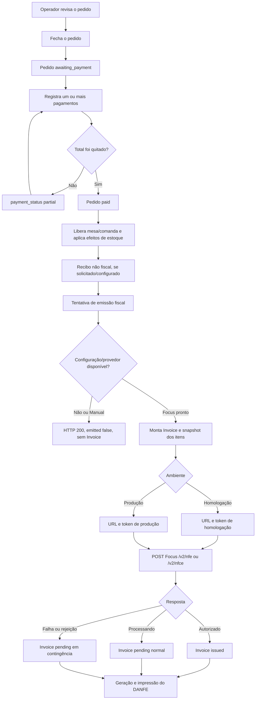

# Fluxo do pagamento à emissão da NF-e/NFC-e

Este documento descreve o comportamento **atual** do StarChef, do fechamento e
pagamento de um pedido até a geração, autorização e impressão do documento
fiscal. O fluxo foi conferido no backend Django, na retaguarda Vue e no PDV
Flutter em 30/08/2026.

> **Aviso fiscal:** CRT, CFOP, NCM, CEST, CSOSN/CST, PIS, COFINS, série e
> numeração devem ser definidos ou validados pela contabilidade. O StarChef
> transporta e calcula os campos configurados; ele não determina o
> enquadramento tributário correto do estabelecimento ou do produto.

Para configurar credenciais, certificado, CSC e empresa Focus, consulte
[`FOCUS_NFE_CONFIGURACAO.md`](FOCUS_NFE_CONFIGURACAO.md). Para a arquitetura da
integração, consulte
[`INTEGRACAO_FISCAL_BRASIL.md`](INTEGRACAO_FISCAL_BRASIL.md).

## Resumo executivo

Pagamento e emissão fiscal são operações separadas:

- pagar integralmente muda o pedido para `paid`, libera mesa/comanda, registra
  o recebimento e pode baixar estoque;
- depois disso, uma tentativa de emissão chama
  `POST /api/v1/invoices/emit/`;
- falha fiscal ou de impressão **não desfaz o pagamento**;
- o provedor `manual` não transmite, não cria `Invoice` e responde
  `emitted: false`;
- o provedor `focus_nfe`, quando possui URL e token do ambiente, cria o
  documento local e transmite para a Focus;
- em homologação, o documento é de teste e o DANFE mostra
  **SEM VALOR FISCAL — HOMOLOGAÇÃO**;
- cada item usa primeiro o perfil fiscal do produto e depois o perfil padrão
  da configuração fiscal;
- sem qualquer perfil, a emissão não é bloqueada antecipadamente: o backend
  envia fallbacks genéricos, inclusive NCM `00000000`, que normalmente causam
  rejeição fiscal.

## Visão geral do fluxo



## 1. Preparação anterior à venda

### 1.1 Módulo e configuração fiscal

O endpoint de notas exige o módulo `financeiro` habilitado na conta. Cada
restaurante possui uma `FiscalConfig` ligada à sua filial.

Ao criar um restaurante, o serializer aceita `fiscal_provider` e usa `manual`
como padrão. O backend cria ou recupera a configuração fiscal por meio de
`ensure_fiscal_config`. Portanto:

- a ausência de escolha explícita no cadastro novo resulta normalmente em
  provedor `manual`;
- o clique de pagamento **não escolhe** o provedor naquele momento;
- em registros antigos, excluídos ou inconsistentes, pode não existir uma
  configuração fiscal ativa. Nesse caso a tentativa de emissão também é
  recusada sem criar nota.

### 1.2 Focus NFe

Para o provedor `focus_nfe`, existem dois níveis de credenciais:

1. a conta StarChef guarda token mestre, URLs de produção/homologação e webhook;
2. a configuração do restaurante guarda os tokens individuais da empresa para
   produção e homologação.

O token mestre sincroniza a empresa, mas não é usado diretamente na emissão.
O restaurante precisa ser sincronizado para receber o token individual do
ambiente selecionado.

### 1.3 Produtos e perfis fiscais

O perfil fiscal é compartilhado pela conta e pode ser associado a vários
produtos. Ele contém NCM, CEST, CFOP, origem, CSOSN/CST, alíquotas de ICMS,
PIS/COFINS e tributos aproximados.

Há dois conceitos diferentes:

- `FiscalProfile.is_default`: apenas destaca/sugere o perfil no cadastro;
- `FiscalConfig.default_profile`: é o perfil realmente usado como fallback na
  emissão quando o produto não possui um perfil próprio.

Marcar somente `is_default` não configura o fallback fiscal da filial.

## 2. Fechamento do pedido

No PDV, o operador revisa o pedido antes de entrar no pagamento. Se ainda
existirem itens pendentes, eles são enviados à cozinha primeiro. Em seguida o
cliente chama:

```text
POST /api/v1/orders/{order_id}/close/
```

O backend executa `close_order` dentro de uma transação:

1. bloqueia a linha do pedido para evitar fechamentos concorrentes;
2. recusa pedidos já pagos, cancelados ou estornados;
3. aplica desconto, exigindo gerente quando o desconto é maior que zero;
4. aplica ou remove a taxa de serviço;
5. recalcula subtotal e total;
6. quando recebido, compara `expected_total` com o total do servidor;
7. muda o pedido para `awaiting_payment`;
8. recalcula `payment_status` considerando pagamentos já aprovados.

Se o pedido já estiver integralmente pago após o recálculo, ele passa direto
para `paid`, libera mesa/comanda e executa a baixa de estoque quando o
restaurante usa baixa no pagamento.

## 3. Registro do pagamento

Cada pagamento é enviado para:

```text
POST /api/v1/orders/{order_id}/pay/
```

O corpo informa forma de pagamento, valor e, no PDV Flutter, uma chave de
idempotência. O backend `register_payment`:

1. devolve o pagamento existente quando a mesma chave idempotente já foi usada;
2. bloqueia o pedido durante o cálculo;
3. recusa pedido cancelado, estornado ou já pago;
4. exige uma forma ativa pertencente ao mesmo restaurante;
5. valida a sessão de caixa quando ela é obrigatória;
6. aceita pagamento parcial e combinação de formas;
7. permite valor recebido acima do saldo somente em dinheiro;
8. grava separadamente o valor aplicado e o troco;
9. cria movimento de venda no caixa para pagamento em dinheiro;
10. muda o pedido para `partial` ou `paid`.

Quando o total é quitado:

- `Order.payment_status = paid`;
- `Order.status = paid`;
- mesa e comanda são liberadas quando aplicável;
- a baixa de estoque ocorre se `stock_deduction_timing = payment`;
- o pagamento fica preservado mesmo se a etapa fiscal falhar depois.

O recibo comum do pedido é um comprovante operacional e contém a indicação de
que não é documento fiscal. Ele não substitui DANFE, NF-e ou NFC-e.

## 4. Quem dispara a emissão

### 4.1 Retaguarda web

O `PdvView.vue` registra o pagamento e mostra “Pedido pago”, mas não chama a
emissão automaticamente. Na visualização de um pedido pago, a tela
`ResourceFormView.vue` exibe **Emitir nota fiscal / DANFE**.

Ao clicar nesse botão, a retaguarda:

1. chama `POST /invoices/emit/`;
2. se receber `emitted: false`, mostra o motivo e encerra o fluxo;
3. se receber uma nota, chama `POST /invoices/{invoice_id}/print/`;
4. abre o HTML do DANFE em outra janela e chama a impressão do navegador.

### 4.2 PDV Flutter

Quando o pagamento sincronizado quita o pedido, `_completePaidOrder` tenta
imprimir o recibo e chama `_emitFiscalInvoice` automaticamente. Um pedido pago
reaberto também exibe **Emitir NFC-e / Imprimir DANFE**.

Porém, no modo offline-first atual, toda escrita em `/invoices/` é interceptada
antes da chamada HTTP e gravada na `fiscal_queue` local, inclusive quando a
internet está disponível. A fila fiscal:

- é separada da fila de vendas;
- envia uma nota por ciclo, a cada 30 segundos, ou em **Sincronizar agora**;
- repete falhas transitórias em 15 s, 30 s, 1 min, 5 min e 15 min;
- marca erros HTTP/validação como `FAILED` e não insiste automaticamente.

Como a chamada inicial retorna `_fiscal_pending: true`, o Flutter não solicita
o DANFE naquele momento. A autorização posterior da fila também não dispara
hoje uma segunda etapa automática de impressão. Essa limitação está registrada
na seção [Pontos de atenção da implementação atual](#12-pontos-de-atenção-da-implementação-atual).

Se o pagamento inteiro ainda estiver apenas no SQLite aguardando
sincronização, `_completePaidOrder` não chama a emissão automática. Primeiro a
venda precisa subir; depois a nota precisa ser solicitada pelo fluxo fiscal.

## 5. Pré-validação do endpoint de emissão

O cliente envia:

```http
POST /api/v1/invoices/emit/
Content-Type: application/json

{
  "order": "UUID_DO_PEDIDO",
  "cpf": "12345678909",
  "cpf_name": "Nome do consumidor"
}
```

`cpf` e `cpf_name` são opcionais. O endpoint valida o tenant e procura o pedido.
Depois chama `fiscal_emission_unavailable_reason`.

| Situação | HTTP | Resultado |
|---|---:|---|
| Pedido não existe na conta | 404 | Nenhuma nota criada |
| Sem configuração fiscal ativa | 200 | `emitted: false`; nenhuma nota criada |
| Provedor `manual` | 200 | `emitted: false`; nenhuma nota criada |
| Provedor desconhecido | 200 | `emitted: false`; nenhuma nota criada |
| Focus sem configuração da conta | 200 | `emitted: false`; nenhuma nota criada |
| Focus sem URL do ambiente | 200 | `emitted: false`; nenhuma nota criada |
| Focus sem token individual do ambiente | 200 | `emitted: false`; nenhuma nota criada |
| Focus com URL e token | 201 | Monta a nota e tenta transmitir |

Exemplo do retorno não emitido:

```json
{
  "emitted": false,
  "message": "Nota fiscal nao emitida: O provedor fiscal Manual esta selecionado e nao transmite notas fiscais."
}
```

O modo Manual não é uma nota local em rascunho neste endpoint. Embora exista
uma classe `ManualFiscalProvider.emit`, a pré-validação impede que ela seja
alcançada pela API normal.

## 6. Montagem da nota local

Quando o Focus está disponível, `emit_fiscal_invoice` bloqueia novamente o
pedido e monta a nota em uma transação:

1. resolve a configuração fiscal da filial ou do restaurante;
2. recusa uma segunda emissão se o pedido já possui nota `pending` ou `issued`;
3. exclui itens cancelados e itens de cortesia;
4. recusa o pedido quando não resta item faturável;
5. reserva `next_number`, série, modelo, ambiente e CRT;
6. cria chave de acesso e QR Code local;
7. grava emitente, consumidor e totais no `Invoice`;
8. cria um snapshot tributário de cada linha em `InvoiceItem`;
9. chama o provedor Focus;
10. incrementa `FiscalConfig.next_number`, inclusive quando a nota fica
    processando ou entra em contingência.

O relacionamento `Order -> Invoice` é um para um. Alterar um produto ou perfil
depois da emissão não muda os `InvoiceItem` já gravados.

### Estado do pedido exigido

As interfaces só oferecem o botão fiscal para pedidos com
`payment_status = paid`. Entretanto, o endpoint do backend não valida hoje se
o pedido está pago; uma chamada direta à API consegue emitir um pedido aberto.
Essa é uma proteção de interface, não uma regra de domínio no servidor.

## 7. Produto com perfil, perfil padrão e produto sem perfil

Para cada `OrderItem`, a escolha é:

```text
perfil = produto.fiscal_profile OU configuracao_fiscal.default_profile
```

| Cadastro do item | Snapshot em `InvoiceItem` | Payload enviado à Focus |
|---|---|---|
| Produto com perfil próprio | Copia todos os campos daquele perfil | Usa o snapshot do perfil |
| Produto sem perfil, com `default_profile` na filial | Copia o perfil padrão | Usa o snapshot do perfil padrão |
| Produto e filial sem perfil | Campos fiscais ficam vazios ou zerados | Aplica fallbacks genéricos |

Os fallbacks enviados à Focus quando nenhum perfil existe são:

| Campo | Fallback atual |
|---|---|
| NCM | `00000000` |
| CEST | omitido |
| CFOP | `5102` |
| Origem ICMS | `0` |
| Situação ICMS | `102` |
| CST PIS | `49` |
| Valor PIS | `0` |
| CST COFINS | `49` |
| Valor COFINS | `0` |
| Tributos aproximados | `0` |

Isso permite que o documento seja montado, mas `00000000` não é um NCM real.
O comportamento esperado na prática é rejeição pela Focus/SEFAZ. Por isso um
produto sem perfil próprio só deve ser faturado se a filial possuir um
`default_profile` completo e adequado àquele produto.

O código atual também não ignora automaticamente um perfil marcado como
inativo se ele ainda estiver associado ao produto ou configurado como padrão.

## 8. Payload enviado à Focus

O modelo do documento define o recurso:

| Modelo configurado | Endpoint Focus |
|---|---|
| NF-e `55` | `POST /v2/nfe?ref=starchef-{invoice_uuid}` |
| NFC-e `65` | `POST /v2/nfce?ref=starchef-{invoice_uuid}` |
| SAT/CF-e `59` | Não suportado pelo provedor Focus |

A referência `starchef-{uuid}` identifica a nota no envio, consulta, webhook e
cancelamento.

O payload inclui:

- natureza “Venda ao consumidor”;
- data de emissão;
- emitente e consumidor final;
- presença `1` para venda presencial ou `4` para delivery;
- produtos, desconto, total e tributos aproximados;
- itens e respectivos campos fiscais;
- pagamentos aprovados e troco;
- CPF/nome quando informados.

Mapeamento das formas de pagamento:

| Forma StarChef | Código enviado |
|---|---:|
| Dinheiro | `01` |
| Cartão de crédito | `03` |
| Cartão de débito | `04` |
| Voucher | `10` |
| PIX | `17` |
| Outra | `99` |
| Nenhum pagamento encontrado | `90`, valor `0.00` |

Em dinheiro, `valor_pagamento` inclui o valor devolvido como troco, e o total do
troco também segue em `valor_troco`.

## 9. Homologação e produção

| Ambiente | URL/token usados | Validade fiscal | DANFE |
|---|---|---|---|
| Homologação (`2`) | URL e token de homologação | Sem validade fiscal | Mostra “SEM VALOR FISCAL — HOMOLOGAÇÃO” |
| Produção (`1`) | URL e token de produção | Documento fiscal real | Não mostra a faixa de homologação |

O ambiente não é escolhido pelo botão de pagamento. Ele vem da
`FiscalConfig`. Série, próximo número, CSC e token precisam corresponder ao
ambiente.

A interface Flutter usa o texto “NFC-e” mesmo quando o modelo configurado pode
ser NF-e `55`; quem decide entre `/v2/nfe` e `/v2/nfce` é o backend.

## 10. Respostas da Focus e estados da nota

| Resposta/situação | Estado local |
|---|---|
| `autorizado` | `status = issued`, emissão normal |
| `processando` ou `processando_autorizacao` | `status = pending`, emissão normal |
| `cancelado` | `status = cancelled` |
| Timeout, erro de rede ou resposta inesperada | `status = pending`, `emission_type = 9` |
| Rejeição fiscal | Atualmente também vira `pending`, `emission_type = 9` |

Quando autorizada, a nota recebe chave, protocolo, número/série confirmados,
data de autorização, URLs de XML/DANFE e QR Code retornados pela Focus.

Quando a chamada ao provedor lança qualquer exceção, o serviço preserva a venda
e converte a nota para contingência:

- refaz a chave de acesso com `tpEmis = 9`;
- mantém a nota `pending`;
- grava o motivo em `error_message`;
- permite gerar DANFE com aviso de contingência;
- mantém o número consumido.

Hoje esse tratamento amplo inclui uma rejeição explícita da SEFAZ, não somente
indisponibilidade técnica. Esse comportamento exige cuidado: corrigir cadastro
fiscal e indisponibilidade de rede são problemas diferentes.

## 11. DANFE, impressão e acompanhamento

O DANFE é criado por:

```text
POST /api/v1/invoices/{invoice_id}/print/
```

O backend renderiza:

- HTML para navegador/spool do Windows;
- texto monoespaçado de 48 colunas para ESC/POS;
- QR Code e chave de acesso;
- indicação de homologação;
- indicação de contingência ou autorização pendente.

Depois cria um `PrintJob` do tipo `fiscal_danfe`. A impressão física é feita
pelo navegador ou pelo agente local do PDV, conforme o cliente.

O endpoint de impressão não exige hoje `status = issued`. Assim, também é
possível gerar DANFE de nota `pending` ou em contingência. Nesse caso ele mostra
“AGUARDANDO AUTORIZAÇÃO” ou o aviso correspondente.

Para acompanhar documentos assíncronos:

- `POST /api/v1/invoices/{id}/refresh-status/` consulta a Focus;
- o webhook Focus atualiza a nota pela referência;
- `POST /api/v1/invoices/{id}/cancel/` solicita cancelamento;
- `python manage.py reprocess_pending_invoices` retransmite notas `pending` em
  contingência.

O reprocessamento de contingência não possui agendamento Celery/Beat no código
atual. O comando precisa ser executado manualmente ou agendado externamente.

## 12. Pontos de atenção da implementação atual

Esta seção registra o que o sistema faz hoje, mesmo quando ainda não é o fluxo
ideal desejado.

1. **Retaguarda não emite no clique de pagamento.** O botão de emissão fica na
   visualização posterior do pedido pago.
2. **Flutter coloca toda emissão na fila fiscal.** A chamada inicial não recebe
   imediatamente a nota autorizada e, por isso, não imprime o DANFE naquele
   gesto.
3. **A fila Flutter considera qualquer HTTP bem-sucedido como autorizado.** Um
   retorno HTTP 200 com `emitted: false`, usado pelo modo Manual ou por Focus
   incompleto, também é marcado localmente como `AUTHORIZED` porque
   `pushFiscal` não inspeciona esse campo.
4. **Não há impressão automática após a fila autorizar.** O retorno da fila é
   salvo localmente, mas não chama `/invoices/{id}/print/` depois.
5. **Resposta de impressão e Flutter divergem.** O endpoint retorna
   `print_job_id`, `status` e `html`; o Flutter procura também um objeto
   `printer` na resposta para imprimir manualmente.
6. **Produto sem perfil não é barrado.** O fallback NCM `00000000` segue até a
   Focus e tende a causar rejeição.
7. **Rejeição vira contingência.** O `except` amplo do serviço trata rejeição
   fiscal como se fosse indisponibilidade técnica.
8. **O backend não exige pedido pago.** A UI restringe o botão, mas a API aceita
   emissão direta de pedido aberto.
9. **Status “processando” pode ser impresso.** A retaguarda chama impressão logo
   depois da resposta 201, mesmo que a nota ainda esteja `pending`.
10. **Segunda emissão é bloqueada.** Nota `pending` ou `issued` vinculada ao
    pedido faz uma nova tentativa retornar HTTP 400.

## 13. Matriz dos cenários principais

| Cenário | O pagamento conclui? | Cria `Invoice`? | Chama Focus? | Resultado esperado hoje |
|---|---:|---:|---:|---|
| Sem configuração fiscal ativa | Sim | Não | Não | `emitted: false` |
| Provedor Manual | Sim | Não | Não | `emitted: false` |
| Focus sem URL/token do ambiente | Sim | Não | Não | `emitted: false` |
| Focus homologação + produto com perfil completo | Sim | Sim | Sim | Autoriza, processa ou retorna rejeição de teste |
| Focus homologação + produto sem perfil + perfil padrão completo | Sim | Sim | Sim | Usa o perfil padrão |
| Focus homologação + produto e filial sem perfil | Sim | Sim | Sim | Envia NCM `00000000`; provável rejeição |
| Focus produção configurado | Sim | Sim | Sim | Documento fiscal real |
| Focus indisponível | Sim | Sim | Tenta | Nota `pending` em contingência |
| Focus rejeita dados fiscais | Sim | Sim | Sim | Hoje fica `pending` em contingência com erro gravado |
| Pedido já possui nota `pending`/`issued` | Já estava pago ou não | Não cria outra | Não | HTTP 400 |
| Falha de impressão | Sim | Mantém a nota | Não altera autorização | Venda e nota não são desfeitas |

## 14. Checklist de teste completo em homologação

1. Habilitar o módulo `financeiro` na conta.
2. Configurar token mestre e URLs da Focus.
3. Selecionar `focus_nfe`, modelo `65` ou `55` e ambiente `2`.
4. Sincronizar a empresa e confirmar o token de homologação.
5. Conferir CNPJ, IE, CRT, endereço, certificado e, para NFC-e, CSC/idToken.
6. Configurar série e próximo número de homologação.
7. Criar perfis fiscais completos e associá-los aos produtos.
8. Se produtos puderem ficar sem perfil, configurar explicitamente
   `FiscalConfig.default_profile`.
9. Abrir caixa, criar pedido, fechar e registrar pagamento integral.
10. Confirmar que o pedido ficou `paid` e que o recebimento apareceu no caixa.
11. Disparar a emissão pelo detalhe do pedido na retaguarda ou pelo PDV.
12. Confirmar `Invoice`, `InvoiceItem`, ambiente `2`, número e chave.
13. Conferir o status Focus: `issued`, `pending` ou contingência com erro.
14. Validar NCM, CFOP, CSOSN/CST, PIS e COFINS de cada item no snapshot.
15. Gerar o DANFE e conferir a faixa **SEM VALOR FISCAL — HOMOLOGAÇÃO**.
16. Conferir chave, protocolo, QR Code, pagamentos e troco.
17. Testar separadamente produto com perfil próprio, com perfil padrão e sem
    qualquer perfil.
18. Corrigir todas as rejeições antes de configurar produção.

## 15. Arquivos que implementam o fluxo

| Parte | Arquivo principal |
|---|---|
| Fechamento do pedido | `backend/apps/orders/services.py` |
| Endpoint fechar/pagar | `backend/apps/orders/views.py` |
| Registro do pagamento | `backend/apps/payments/services.py` |
| Emissão e DANFE | `backend/apps/invoices/services.py` |
| Provedores Manual/Focus | `backend/apps/invoices/providers.py` |
| Endpoints de nota | `backend/apps/invoices/views.py` |
| Modelos e snapshots fiscais | `backend/apps/invoices/models.py` |
| PDV web | `frontend/src/views/PdvView.vue` |
| Emissão no detalhe web | `frontend/src/views/ResourceFormView.vue` |
| Fluxo de pagamento Flutter | `flutter/lib/features/home/presentation/home_page.dart` |
| Fila fiscal Flutter | `flutter/lib/core/data/fiscal_queue_service.dart` |
| Envio da fila fiscal | `flutter/lib/core/data/sync_service.dart` |
| Interceptação offline-first | `flutter/lib/core/data/offline_first_gateway.dart` |

